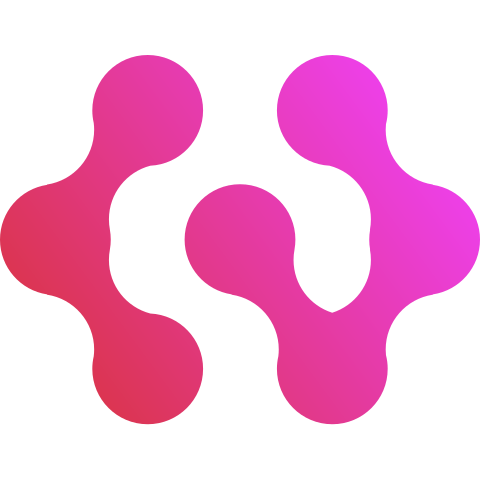

<p align="center">
  
</p>

<h1 align="center">IO</h1>

<p align="center">
  <strong>AI Orchestrator Daemon — manage specialized agent squads for your software projects</strong>
</p>

<p align="center">
  <a href="https://michaeljolley.github.io/io">Documentation</a> •
  <a href="#getting-started">Getting Started</a> •
  <a href="#architecture">Architecture</a>
</p>

---

## What is IO?

IO is an always-running daemon that acts as your personal AI orchestrator. You talk to IO, and IO manages teams of specialized AI agents ("squads") that work on your codebases.

- **One conversation interface** — talk to IO via TUI, Telegram, or the REST/WebSocket API
- **Squad delegation** — IO automatically routes project questions to the right squad
- **Cron schedules** — automate recurring tasks like daily standups or issue triage
- **Inbox system** — squads can send you deliverables or ask blocking questions
- **Model management** — token tracking and configurable model selection per agent

## Architecture

```
┌─────────────────────────────────────────────┐
│                   You                        │
│         (TUI / Telegram / API)              │
└──────────────────┬──────────────────────────┘
                   │
┌──────────────────▼──────────────────────────┐
│              Orchestrator                    │
│   (Copilot SDK session, tool-calling)       │
└──────┬───────────┬──────────────┬───────────┘
       │           │              │
┌──────▼──┐ ┌─────▼────┐ ┌──────▼──────┐
│ Squad A │ │ Squad B  │ │ Scheduler   │
│ (team)  │ │ (team)   │ │ (cron jobs) │
└─────────┘ └──────────┘ └─────────────┘
```

Each squad has:
- **Team Lead** — receives objectives, creates plans, coordinates agents
- **Agents** — specialized workers (developer, reviewer, etc.) that execute tasks
- **Meetings** — structured collaboration between agents for planning and review

## Getting Started

### Prerequisites

- Node.js 22+
- GitHub Copilot access (the daemon uses `@github/copilot-sdk`)
- Git

### Installation

```bash
git clone https://github.com/michaeljolley/io.git
cd io
npm install
npm run build
```

### Running

```bash
# Start the daemon
npm start

# Or in development mode (auto-reload)
npm run dev
```

The daemon starts on port `7777` by default. Configure via `~/.io/config.json` or the `IO_PORT` environment variable.

### Configuration

Create `~/.io/config.json`:

```json
{
  "apiPort": 7777,
  "defaultModel": "claude-opus-4.6",
  "logLevel": "info",
  "maxInstancesPerSquad": 3,
  "telegram": {
    "botToken": "your-token-from-botfather",
    "allowedChatIds": [12345678]
  }
}
```

All settings can also be controlled via environment variables (which take priority):

| Variable | Config Key | Default |
|----------|-----------|---------|
| `IO_PORT` | `apiPort` | `7777` |
| `IO_LOG_LEVEL` | `logLevel` | `info` |
| `IO_MODEL` | `defaultModel` | `claude-opus-4.6` |
| `IO_DATA_DIR` | `dataDir` | `~/.io` |
| `TELEGRAM_BOT_TOKEN` | `telegram.botToken` | — |
| `TELEGRAM_ALLOWED_CHAT_IDS` | `telegram.allowedChatIds` | — |

See the [Configuration Guide](https://michaeljolley.github.io/io/guides/configuration/) for full details.

## Key Features

### Squads

Hire a squad for any project:

> "Hire a squad for my-app at ~/projects/my-app"

IO creates a team with a lead and specialized agents. All future questions about that project get routed to the squad automatically.

### Schedules

Automate recurring work with cron expressions:

> "Create a daily standup for my-app at 9am on weekdays — have them review open issues and report progress"

### Inbox

Squads communicate back via the inbox:
- **Deliverables** — status reports, completed summaries
- **Blocking questions** — the squad pauses and waits for your answer

### Clients

| Client | Description |
|--------|-------------|
| TUI | Terminal interface built with Ink |
| Telegram | Bot integration via Grammy |
| REST API | HTTP endpoints at `/api/*` |
| WebSocket | Real-time streaming at `/ws` |

## Project Structure

```
packages/
├── shared/      # Types, constants, shared utilities
├── daemon/      # Core daemon (orchestrator, squads, API, scheduler)
├── tui/         # Terminal UI (Ink/React)
└── telegram/    # Telegram bot client
docs/            # Astro Starlight documentation site
```

## Development

```bash
# Build all packages
npm run build

# Run in dev mode (watches daemon)
npm run dev

# Build documentation
cd docs && npm run build
```

## Documentation

Full documentation is available at **[michaeljolley.github.io/io](https://michaeljolley.github.io/io)**.

## License

MIT
